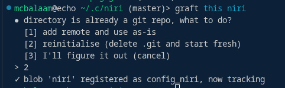
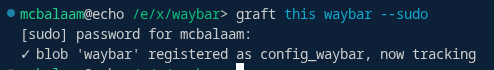
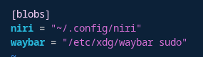
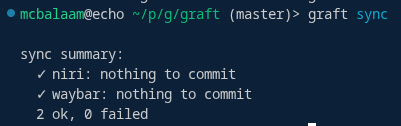
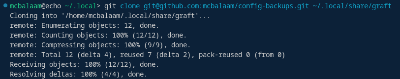
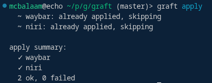

# graft: Backups Done Right

### graft is a Git backup/versioning utility based on Git submodules

Have you ever wished you could back up your `nginx/sites-available` folder and do it simple and quick? Tinker with your configs without breaking everything in process? graft is here to help!

0. Create and configure your Access Token ([here for GitHub](https://github.com/settings/tokens))

1. Initialize the repository:

`graft init git@github.com:user/backup-repo.git --token=ghp_...`

2. ...or omit the token flag and put it in `.config/graft.toml`:


3. Add any directory you desire as a blob:



...even if it's root owned!



4. Watch your blobs appear in the repo config:



5. Sync your configs...



6. Clone the main repo on a new machine...



7. Restore your configuration!



---

## Commands

| Command | Description |
|---|---|
| `graft init <remote> <base-url>` | Initialise main repo and config |
| `graft this <name> [--sudo]` | Start tracking current directory as blob |
| `graft here [name]` | Clone existing blob into current directory |
| `graft apply [--force] [name]` | Restore blob(s) to paths from config |
| `graft sync` | Commit and push all blobs |
| `graft pull` | Pull updates for all blobs |
| `graft remove <name>` | Remove blob from tracking |

## Blob flags

Flags are set in `graft.toml` after the path:

```toml
[blobs]
nvim    = "~/.config/nvim"
waybar  = "/etc/xdg/waybar" sudo immutable
```

| Flag | Description |
|---|---|
| `sudo` | Directory is root-owned; graft uses sudo for `mkdir`-ing/`chown`-ing |
| `immutable` | Path cannot be reassigned via `graft here` |