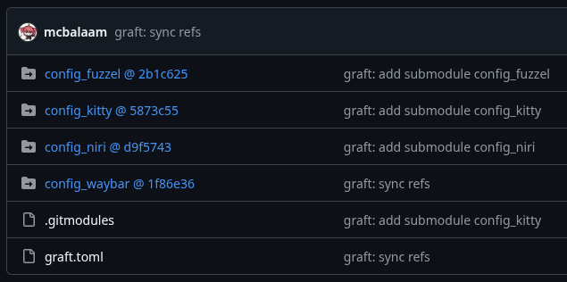

# graft: Backups Done Right

### graft is a Git backup/versioning utility based on Git submodules

Have you ever wished you could back up your `nginx/sites-available` folder and do it simple and quick? Tinker with your configs without breaking everything in process? Store and version your configs on a Git platform? graft is here to help!



Here's how it's done:

0. Create and configure your Access Token ([here for GitHub](https://github.com/settings/tokens))

1. Initialize the repository:

`graft init git@github.com:user/backup-repo.git`

2. Put your token in `.config/graft.toml`:


3. Add any directory you desire as a blob:


...even if it's root owned!


4. Watch your blobs appear in the repo config:


5. Sync your configs...


6. Clone the main repo on a new machine...


7. Restore your configuration!


graft is distributed as a single Go binary, but you can also build it yourself: `make install`.

---

## Commands

| Command | Description |
|---|---|
| `graft init <remote>` | Initialise main repo and config |
| `graft this <name> [--sudo] [--public]` | Start tracking current directory as blob |
| `graft here [name]` | Clone existing blob into current directory |
| `graft apply [--force] [name]` | Restore blob(s) to paths from config |
| `graft push [name]` | Commit and push blob(s) |
| `graft pull [--force] [name]` | Pull updates for blob(s) |
| `graft remove <name>` | Remove blob from tracking |
| `graft switch <name>` | Switch active repo |
| `graft repo add <remote>` | Clone and register a remote graft repo |
| `graft repo remove <name>` | Remove a repo from config |
| `graft repo list` | List all registered repos |

## Multiple repos

graft supports multiple repos — useful for testing someone else's dotfiles without touching your own.

```bash
# register and clone a remote graft repo
graft repo add git@github.com:user/their-dotfiles.git

# see what's registered
graft repo list

# switch to it
graft switch their-dotfiles

# restore their blobs
graft apply --force

# switch back
graft switch master
graft apply
```

Active repo is shown in all command output: `[master] push summary:`.

Default visibility for new blobs is set during `graft init` and stored in `graft.toml` as `public = false`. Override per-blob with `--public`.

## Blob flags

Flags are set in `graft.toml` after the path:

```toml
[blobs]
nvim    = "~/.config/nvim"
waybar  = "/etc/xdg/waybar sudo immutable"
```

| Flag | Description |
|---|---|
| `sudo` | Directory is root-owned; graft uses sudo for `mkdir`-ing/`chown`-ing |
| `immutable` | Path cannot be reassigned via `graft here` |

---

## Disclaimer

graft is a Git wrapper. It doesn't encrypt, modify or filter any of your data. Treat the remote as fully trusted — graft assumes it always is.